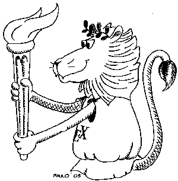

# UFPEThesis

**Classe LaTeX para tipografia de teses e dissertações na UFPE**

<table border=0>
<tr>
<td></td>
<td>+</td>
<td></td>
<td>=</td>
<td></td>
</tr>
</table>

UFPEThesis é uma classe LaTeX para tipografia de monografias de graduação, dissertações de mestrado e teses de doutorado. Embora tenha sido escrita para ser utilizada principalmente pelos alunos das ditas Ciências Exatas (Matemática, Computação, Estatística, Física, Química, etc.) que, tradicionalmente, utilizam o TeX/LaTeX como plataforma de processamento de textos, a UFPEThesis é suficientemente configurável e facilmente adaptável para ser útil a alunos de praticamente todos os cursos da [UFPE](http://www.ufpe.br) e também de outras instituições.

## Instalação

Num sistema Linux com a distribuição TeXLive:

* clone o repositório
* no diretório clonado (contendo o `Makefile`): `make`

Isso deve tornar a classe disponível para o usuário a partir de qualquer diretório.

Nos demais ambientes, procurar a documentação para instalar uma classe LaTeX. Em qualquer caso, copiar os arquivos do diretório [latex](latex/) torna a classe disponível no local para onde foram copiados.

## Utilização

O [manual](manual/manual.pdf) é em meta-documento que ilustra a utilização da UFPEThesis.

